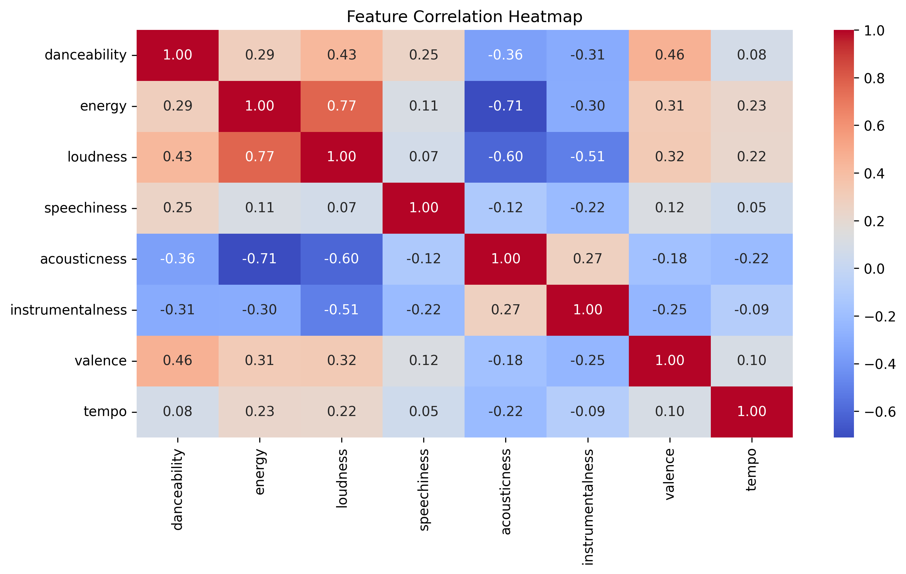
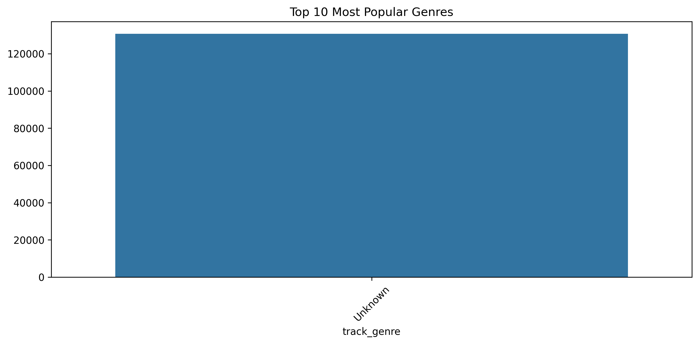

# 🎵 Spotify-Style Music Recommender System

This project builds a Spotify-style music recommendation system using song-level audio features, similarity-based learning, exploratory data analysis, and neural embeddings.

## 🔍 Overview
- Dataset: Spotify Audio Features (April 2019)
- Methods:
  - K-Nearest Neighbors (KNN) for similarity-based recommendations
  - Feature normalization and Euclidean distance metrics
  - Mood classification using valence and energy
  - Neural network autoencoder for song embeddings
- Tools: Python, pandas, scikit-learn, seaborn, TensorFlow/Keras

## 📂 Repository Structure

## 📊 Key Visualizations

### Feature Distributions


### Feature Correlations


### Mood Classification


### Genre Distribution


### Model Training Loss


## 🎧 Recommendation Example
```python
recommend_songs("Shape of You", mood="Happy")
